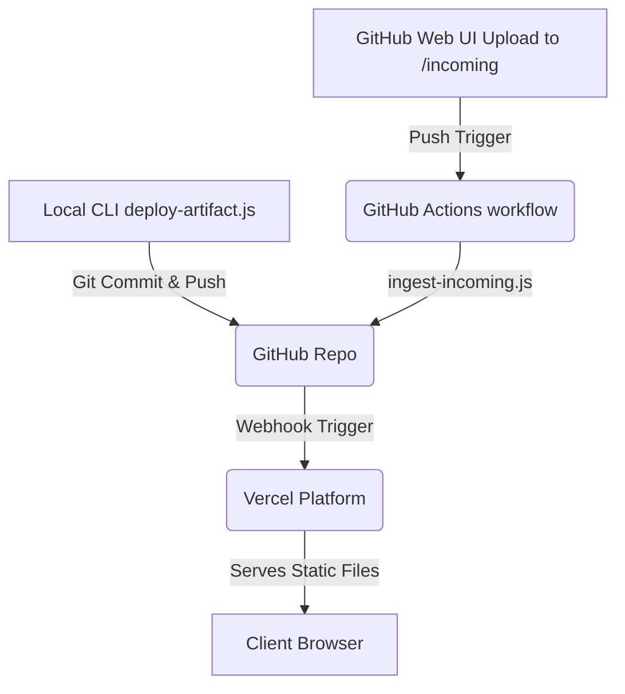

# Architecture

This document describes how `artifact-vault` is designed. It's short because the system has few moving parts. If you're looking for complex architectures, you won't find them here. 

The core design principle is **zero running costs, zero backend management, and high obscurity**.

---

## System Overview



At its core, `artifact-vault` is just a Git repository connected to a Vercel project. Vercel serves the contents of the `/public` directory as static assets via their CDN edge.

We deploy files via two pathways:
1. **The CLI tool (`deploy-artifact.js`):** Runs on your local machine, copies files to the `/public` folder, commits them, and pushes them directly to your repository.
2. **The GitHub UI runner (`ingest-artifact.yml`):** Runs on GitHub Actions. It listens for additions to `/incoming`, runs `ingest-incoming.js` to process and obfuscate them, commits the results, and pushes them back to the repository.

Once Vercel receives the push, it updates the files served by its CDN edge.

---

## File Name Obfuscation

Our security relies entirely on the unpredictability of the file names. If a user can guess the filename, they can access the file.

We generate a 12-character alphanumeric hash using the character set `a-z0-9`. 
- Character set size ($N$) = 36.
- Hash length ($L$) = 12.
- Total search space = $36^{12} \approx 4.73 \times 10^{18}$ combinations.

### Eliminating Modulo Bias
A common mistake in random string generation is using modulo arithmetic on random bytes: `randomByte % 36`. Since 256 is not evenly divisible by 36 ($256 \pmod{36} = 4$), the first 4 characters (`a`, `b`, `c`, `d`) have a slightly higher probability of appearing than the others ($7/256$ vs $6/256$). This degrades the entropy of the hash.

To avoid this, we use **rejection sampling**:
1. We read random bytes from `crypto.randomBytes`.
2. We set a threshold at the largest multiple of 36 that fits in a single byte: $36 \times 7 = 252$.
3. Any random byte value $\ge 252$ is discarded and resampled.
4. Valid bytes are mapped to the character set using modulo 36: `byteValue % 36`.

This guarantees that every character has an identical $1/36$ probability of selection.

---

## Vercel Routing Layer (`vercel.json`)

Vercel handles the routing rules. We use a three-step pipeline:

```json
{
  "cleanUrls": true,
  "routes": [
    { "src": "^/(index\\.html)?$", "status": 404, "dest": "/404.html" },
    { "handle": "filesystem" },
    { "src": "/.*", "status": 404, "dest": "/404.html" }
  ]
}
```

1. **Root Block:** Requests to the root `/` or `/index.html` are explicitly blocked and redirected to `404.html` with a `404` HTTP status. This prevents users from mapping the domain name to find out if it's active.
2. **Filesystem Handler:** The `"handle": "filesystem"` directive tells Vercel to check if the requested URL matches an actual file in `/public`. If it does, Vercel serves the file immediately.
3. **Fallback Block:** Any request that does not match an actual file falls through the filesystem handler and is served `404.html` with a `404` status.

We also enable `cleanUrls`. Vercel automatically redirects `/abc-def.html` to `/abc-def` and serves it without the extension, making the final links look cleaner.

---

## Hardened Security Headers

We inject security headers into every single response via Vercel's global header routing:

| Header | Value | Purpose |
| ------ | ----- | ------- |
| `X-Robots-Tag` | `noindex, nofollow, noarchive, nosnippet` | Instructs search engine crawlers and AI bots not to index, cache, or archive any content in this vault. |
| `X-Content-Type-Options` | `nosniff` | Disables MIME type sniffing, forcing the browser to respect the declared content type. |
| `X-Frame-Options` | `DENY` | Prevents pages from being rendered inside an iframe, blocking clickjacking vectors. |
| `Referrer-Policy` | `no-referrer` | Ensures that if an artifact contains links to external pages, clicking those links won't leak the artifact's URL in the `Referer` header. |
| `Permissions-Policy` | `camera=(), microphone=(), geolocation=()` | Blocks access to browser sensor APIs, keeping pages isolated. |

Additionally, the custom 404 page includes a Content Security Policy (`CSP`) meta tag:
`default-src 'self'; script-src 'none'; object-src 'none'; frame-ancestors 'none';`
This ensures that even if someone manages to inject script elements into a nonexistent URL path, the browser will refuse to execute them on the error page.

---

## Build Optimization (`ignore-build.sh`)

Every time a file is pushed, Vercel runs a build by default. Since this is a static hosting project, there is no compile step, but Vercel still spends time spinning up a container.

To prevent wasting build minutes on documentation updates, we write a custom check in `ignore-build.sh`:
- It compares the current commit hash against the previous commit hash (`git diff --quiet HEAD^ HEAD`).
- If changes are confined to files outside of `/public` and `vercel.json` (such as `README.md`, `docs/`, or `.github/`), it exits with `0` (telling Vercel to skip the build).
- If `/public` or `vercel.json` have changed, it exits with `1` (telling Vercel to rebuild and deploy).

---

## GitHub UI Ingest Pipeline

The Actions pipeline (`/github/workflows/ingest-artifact.yml`) allows uploading files directly through the GitHub web interface:

1. A user uploads an HTML file or an asset folder to the `/incoming` directory via GitHub's interface and commits it to `main`.
2. The commit triggers the GitHub Actions workflow.
3. The workflow runs `ingest-incoming.js`, which loops through all contents in `/incoming` (ignoring `.gitkeep`).
4. If it finds an HTML file, it generates a hash, slugifies the name, and moves it to `/public`.
5. If it finds a subdirectory, it expects an `index.html` to be present. It generates a hash for the folder name, slugifies the description, moves the entire folder to `/public`, and leaves the internal structure intact. This ensures relative paths inside the folder (like CSS/images) don't break.
6. Once processed, it commits the changes back to `main` as `github-actions[bot]`.
7. The commit message includes `[skip ci]` to prevent triggering a recursive GitHub Actions run.
